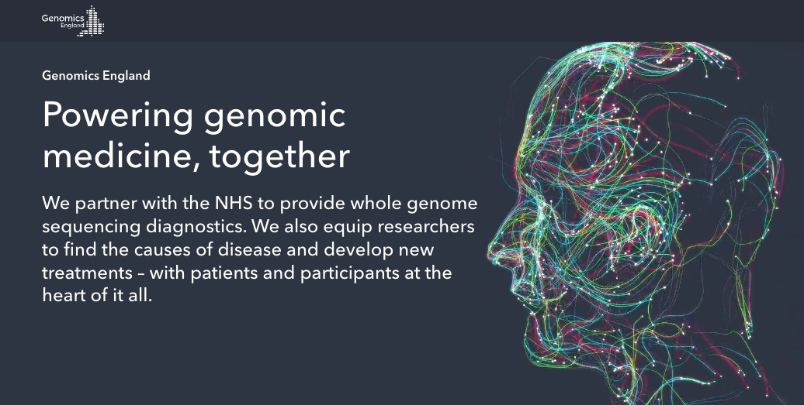

# arquiteto-de-segurança-informatica

----

## Conversa informal

!!! attention "ATENÇÃO"
    - Evento privado.
    - Registo obrigatório.
    - Menores de 18 anos só acompanhados por adulto responsável.
    - Este evento não é um curso e não é uma aula informática, é uma "conversa informal".
    - **ADICIONAL** - possibilidade para participar numa atividade hacking legal.

!!! info "Custo"
    - Gratuito.

----

Olá!

Estás na escola e estás a considerar seguir o ramo de `informática`?

... mas existem tantos ramos ligados à area de informática!

Queres saber como é a vida de um `Arquiteto de Segurança informática`? O que é um `Arquiteto de Segurança informática`?

Como é que funciona a `internet`? Como é que a `internet` funciona em casa? No mundo?

O que é a segurança nas `redes de computadores`, `routers`, `switches`? Precisas uma `firewall` ou `vpn`?

É preciso `encriptar` o disco do `computador` ou os `ficheiro`?

Como pôr uma `página na internet`?

...e a segurança na `cloud`?

O que é `python`, `javascript`?

O que é melhor, `Windows` ou `linux`?

Para que servem os `servidores`, `maquinas virtuais`, `docker container`, e agora as `lambdas`?

Sabias que podes fazer `hacking` de forma `legal`? E podes ser pago por isso `€`?

Já experimentaste o `raspberry pi`, um computador tamanho de um cartão de multi-banco?

`Passwords`, como ter uma que seja segura? Ou nao existem passwords seguras? O que é o `MFA`, `2FA`, `yubikey`?

... [machine learning](https://coral.ai/examples/), e mais... muito mais.

----

## Registo

Se estás na escola e estes tópicos interessam-te, queres tirar dúvidas ou partilhar a tua experiência, então vem participar numa `conversa informal` com [Antonio Feijao](https://www.linkedin.com/in/antoniofeijaouk).

`conversa informal` - desprovido de formalidades, à vontade; descontraído, [infopedia.pt](https://www.infopedia.pt/dicionarios/lingua-portuguesa/informal)

`Data e local` - No primeiro fim de semana de Setembro 2022, data e local na Azinhaga por confirmar.

!!! important "Regista o teu interesse em participar"
    ## `>>>` [INSCRIÇÃO AQUI](https://forms.gle/p8zU9m7DFQHio9gj6) `<<<`

----

## Mais sobre o Antonio Feijao

[Antonio Feijao](https://www.linkedin.com/in/antoniofeijaouk) nasceu e cresceu na [Azinhaga](https://www.freguesiadeazinhaga.pt/), e agora está em inglaterra e é o Arquiteto de Segurança Informática (`Cyber Security Architect`) na empresa inglesa `Genomics England`.

----

### a empresa Genomics England

[Genomics England](https://www.genomicsengland.co.uk/), abreviado `GEL`, é uma empresa do estado inglês no sector da saúde.  

A GEL desenvolve aplicações informáticas que permite aos cientistas e investigadores na área da saúde, analisar e estudar o ADN de uma pessoa e compará-la com o ADN de milhares de outras pessoas.

Em breve, esta análise e estudo vai também incluir o ADN de recém nascidos, bebés.

GEL é uma das empresas tecnologicamente mais avançadas do mundo nesta área.

----

### tamanho dos dados informáticos

Na empresa GEL, as aplicações são enormes em termos de espaço dos dados informáticos.

Estamos a falar na área de Petabytes, equivalente a mil vezes 1 Terabyte, ou 1 milhão de vezes 1 Gigabyte.

----

### confidencialidade e segurança informática

Estas aplicações contém um tipo de informação que é do mais alto nível de confidencialidade que existe.

O nosso ADN inclui informação sobre nós, mas também inclui parte do ADN dos nossos familiares presentes, passados e futuros.

----

### rapidez de resposta e resultados

Para estas aplicações serem úteis, os cientistas precisam de respostas em tempo útil.

----

### acesso altamente controlado

O acesso a estas aplicações, aos dados e resultados, são altamente restritos.

----

### cloud e tradicional centro de dados

`90%` das aplicações estão na cloud, `6%` no centro de dados (`data centre`) e `4%` sao outras entidades, ou `SaaS` (Software as a Services).

----

### responsabilidades do antonio feijao

[Antonio Feijao](https://www.linkedin.com/in/antoniofeijaouk) está a co-liderar a equipa de segurança informática, é o arquiteto de infraestrutura na cloud `AWS`, e é o Arquiteto de Segurança informática.

----

### antonio feijao e azinhaga

[Antonio Feijao](https://www.linkedin.com/in/antoniofeijaouk), natural de [Azinhaga](https://www.freguesiadeazinhaga.pt/), considerada a aldeia mais [ribatejana de Portugal](https://pt.wikipedia.org/wiki/Azinhaga_(Goleg%C3%A3)).

Versão em ingles [Azinhaga](https://en.wikipedia.org/wiki/Azinhaga)

Então, como é que [Antonio Feijao](https://www.linkedin.com/in/antoniofeijaouk) vai da `Azinhaga`, para o nível de responsabilidade numa empresa do estado inglês e adquire um nível de conhecimento informático necessário para ser arquitetura da infraestrutura informática na `aws` cloud, co-liderar uma equipa de segurança information, ser o arquiteto de segurança informática, perceber de Ethical Hacking (hacker legal), redes de computadores, internet, etc...

----

### setembro 2022

[Antonio Feijao](https://www.linkedin.com/in/antoniofeijaouk) vai estar na [Azinhaga](https://www.freguesiadeazinhaga.pt/) em setembro.

----

### antonio feijao gostava de saber

se existe alguém na [Azinhaga](https://www.freguesiadeazinhaga.pt/) que esteja a pensar seguir o ramo de informática, programação, segurança informática, na aws cloud ou centro de dados.

se alguém já está na área de informática mas procura uma opinião, ou quer partilhar uma opinião.

se alguém está interessado na história de [Antonio Feijao](https://www.linkedin.com/in/antoniofeijaouk).

se é possível inspirar outros a explorar mundos lá fora, ou a partir da [Azinhaga](https://www.freguesiadeazinhaga.pt/).

se alguém está interessado em ser Ethical Hacker (hacker legal), e possivelmente ganhar dinheiro extra no tempo livre.

se alguém quer partilhar a sua opinião e experiência, eu quero ouvir.

se a resposta é `SIM`, então regista aqui o teu interesse - <`LINK para um formulário de registo`>

----

## ADICIONAL

----

### ethical hacking introdução

### ethical hacking actividade prática

tens um portátil e gostarias de praticar ou aprender mais sobre:

redes informáticas, redes ip, IPv4, IPv6, DNS, DHCP, VLAN, Routing...  
Linux, Ubuntu, Debian, Centos, Redhat, web-server, databases...  
programação, bash-scripting, python, javascript...  
AWS cloud...  

### ethical hacking avançado

já tens alguma experiência e gostarias de praticar ou aprender mais sobre:

encriptação, encoding, hashing, MD5, SHA<1|256|512>, AES256, AES512, base64, ...  
inspeção de pacotes na rede, tcpdump, wireshark,...  
autenticação, Auth0, ..  
hck legal, red-team, blue-team  
quantum ...  

se a resposta é **`SIM`**, então temos um desafio para ti.

este tipo de atividade é muito prático, "mãos no teclado", por isso é preciso que já tenhas alguns conhecimentos básicos.

Antes de poderes registares o teu interesse, tenho uns desafios para ti.

O registo e desafio começa aqui, boa sorte.

!!! important "Atividade prática, regista aqui o teu interesse em participar"
    ## `>>>` [Atividade prática INSCRIÇÃO AQUI](https://forms.gle/fxJf1mPGaCZR2zLi9) `<<<`

Obrigado,
AF
